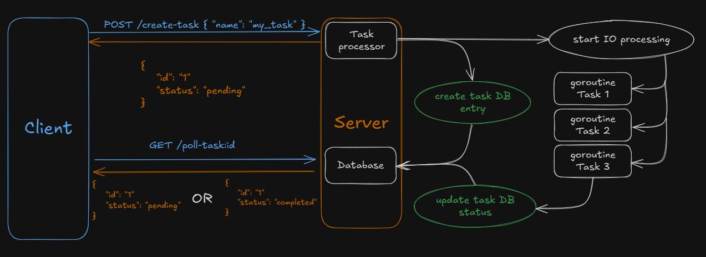

# IO Bound Task API

[ReadMe на русском](README_ru.md)

## Description

This project incudes a simple API example to start IO-bound or computationally heavy tasks and poll the data storage to check their progress.

## Technical features

- Simple API. Two available endpoints: POST to create a new task and GET to poll the status of the task by ID
- Task processing via goroutines. Goroutines allow non-blocking request-independent processing of tasks

## Workflow diagram

The server exposes two endpoints:
| Endpoint | Description |
|----------|-------------|
|`POST /create-task` |Server expects a { "name": "sample_name" } json in request body. This creates a basic task entry in server data storage with status "pending".  The server immediately returns the new task entry with the task ID, which finishes the request.  Then a goroutine is launched, which does the required processing. After the goroutine is finished, the task status is updated to "completed".|
|`GET /poll-task/:id` |At any point the server can be polled for task info. If the task with this ID exists, the server returns the whole task object entry from data storage.  During processing time, the status of the task is "pending", after processing - "completed".  The client can handle this information or adjust the polling strategy in whatever way is most convenient.|

This solution architecture can be easily extended further by creating new POST-GET endpoint pairs for any new type of task.

Additionally, the task processing is decoupled from client-server interaction, which facilitates refactoring and extension of the processing logic.

As per task requirements, the database is simply an in-memory map, protected by RWMutex to avoid concurrency errors. However, any database infrastructure can be added to store task data.

### Documentation

To simplify API development, the project uses two dependencies: [Echo](https://pkg.go.dev/github.com/labstack/echo/v4#section-readme) (for setting up endpoints) и [uuid](https://pkg.go.dev/github.com/google/uuid) (for generating unique task identifiers)

Start by running `go mod tidy` command to install necessary packages.
To quickly start the project, run the `go run .` in the root directory. 

Alternatively, it is possible to build an executable file using `go build -o main.exe .`. Then launch the server by running the new `main.exe` file.